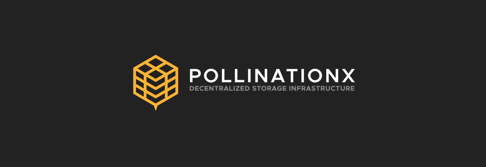

# Welcome to PX

<table data-view="cards"><thead><tr><th></th><th></th><th></th><th data-hidden data-card-target data-type="content-ref"></th></tr></thead><tbody><tr><td>💡</td><td><strong>Discover PollinationX (PX)</strong></td><td>Decentralized storage infrastructure and service layer.</td><td><a href="introduction/start-here.md">start-here.md</a></td></tr><tr><td>⚙️</td><td><strong>Build with PollinationX</strong></td><td>Multi-chain APIs &#x26; SDKs ready to support any Web2 or Web3 decentralized storage needs.</td><td><a href="broken-reference">Broken link</a></td></tr><tr><td>💾</td><td><strong>PX Storage NFTs</strong></td><td>Dynamic NFTs programmed with a predetermined decentralized storage and bandwidth capacity.</td><td><a href="overview/px-storage-nft/">px-storage-nft</a></td></tr></tbody></table>

<figure><figcaption></figcaption></figure>

<table data-view="cards"><thead><tr><th></th><th></th><th></th><th data-hidden data-card-target data-type="content-ref"></th></tr></thead><tbody><tr><td>🗂️ </td><td><strong>PX Drive</strong></td><td>Store and manage your data files in a self-custodial and permissionless way.</td><td><a href="https://wiki.pollinationx.io/overview/px-drive">https://wiki.pollinationx.io/overview/px-drive</a></td></tr><tr><td>⚙️</td><td><strong>PX Drive</strong></td><td>Access developer dashboard,  manage PX subscriptions or access settings and tools.</td><td><a href="https://wiki.pollinationx.io/overview/px-drive">https://wiki.pollinationx.io/overview/px-drive</a></td></tr></tbody></table>
