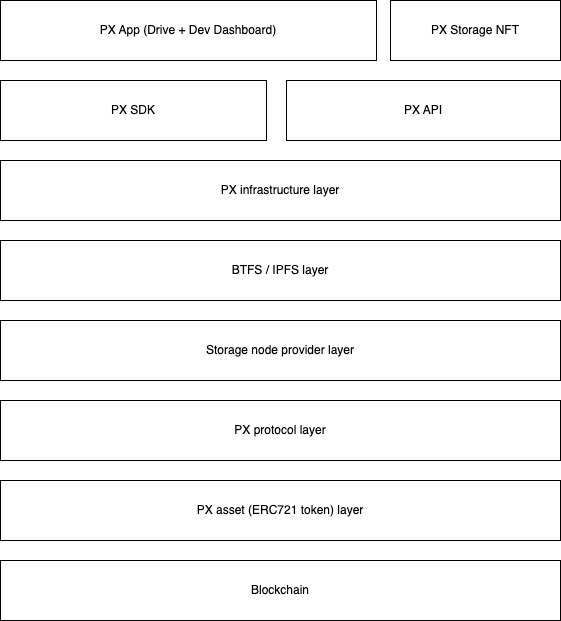

# PX Architecture

### Let's Start

The architecture was designed to be as lightweight and modular as possible while retaining core decentralization primitives. There are five key legos forming the core PX framework:

* Smart contract & libraries
* On-chain storage validation
* PX Nodes
* PX Storage NFT authorisation
* PX client

### Architecture by layers

Connected by the PX SDK (i.e. software development kit), seven layers complete the PollinationX framework:

* dApps & clients (e.g. [PX dApp](https://wiki.pollinationx.io/overview/px-dapp))
* [PX SDK](https://wiki.pollinationx.io/developer-section/px-sdk)
* [PX API](https://wiki.pollinationx.io/developer-section/api-reference)
* [Decentralized storage networks](https://wiki.pollinationx.io/overview/supported-networks-and-storages#supported-storage-networks) (i.e. BTFS, IPFS)
* [Storage nodes](https://wiki.pollinationx.io/developer-section/px-nodes)
* [PX Protocol](https://github.com/PollinationX/smart-contracts)
* PX Assets&#x20;
* [Blockchain networks](https://wiki.pollinationx.io/overview/supported-networks-and-storages#supported-networks)

<figure><figcaption></figcaption></figure>

### Resources






