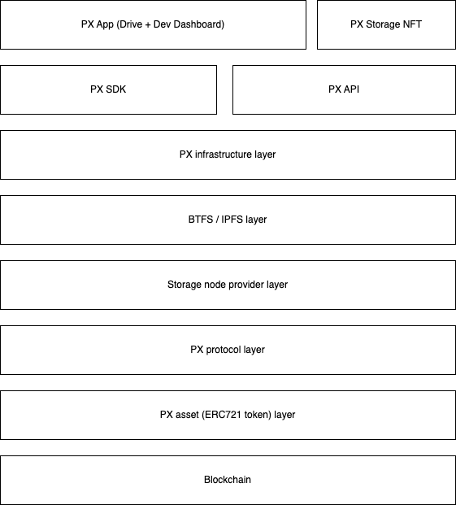

# PX Architecture

### Let's Start

The architecture was designed to be as lightweight and modular as possible while retaining core decentralization primitives. There are five key legos forming the core PX framework:

* Smart contract & libraries
* On-chain storage validation
* PX Nodes
* PX Storage NFT authorisation
* PX client

### Architecture by layers

Connected by the PX SDK (i.e. software development kit), seven layers complete the PollinationX framework:

* dApps & cients (e.g. [PX dApp](https://wiki.pollinationx.io/overview/px-dapp))
* [PX SDK](https://wiki.pollinationx.io/developer-section/px-sdk)
* [PX API](https://wiki.pollinationx.io/developer-section/api-reference)
* [Decentralized storage networks](https://wiki.pollinationx.io/overview/supported-networks-and-storages#supported-storage-networks) (i.e. BTFS, IPFS)
* [Storage nodes](https://wiki.pollinationx.io/developer-section/px-nodes)
* [PX Protocol](https://github.com/PollinationX/smart-contracts)
* PX Assets&#x20;
* [Blockchain networks](https://wiki.pollinationx.io/overview/supported-networks-and-storages#supported-networks)

<figure><figcaption></figcaption></figure>

### Minting a PX Storage NFT

<figure><figcaption></figcaption></figure>

Steps:

* The user mints a new PX sNFT on the blockchain.
* The user interacts with the PX sNFT smart contract through the application (dApp) or an explorer\*.
* The smart contract generates a new PX sNFT token and associates it with the user's wallet address.
* During the minting process, the smart contract also saves the BTNS key for the minted PX sNFT.


\*If PX sNFT is minted directly on a smart contract via blockchain Explorer, the user needs to make PX sNFT registration through registration management to generate the BTNS key.


### PX Storage NFT registration management

The process generates and allocates a unique BTNS key to PX sNFT which is used to reference storage usage metadata on BTFS.&#x20;


**\*IPNS details:** [https://docs.ipfs.tech/concepts/ipns/#mutability-in-ipfs](https://docs.ipfs.tech/concepts/ipns/#mutability-in-ipfs)


### Uploading files and saving storage usage metadata

Steps:

* The user uploads the files on the PX sNFT (prerequisite; available free PX sNFT storage).
* The files are saved BTFS (or any other supported decentralized storage network).
* Upon successful file upload, the PX Node provides the storage usage for the uploaded file and saves storage usage metadata, which includes storage quota, current usage and the CID of the uploaded file.
* The metadata is stored on BTFS and referenced by PX sNFT assigned BTNS key.

### Syncing mechanism

Steps:

* The user wants to ensure that his storage usage metadata is synchronized with the blockchain, so he triggers a sync operation through the dApp or explorer.
* The user calls the synch function on the PX sNFT smart contract providing the PX sNFT token ID.
* The PX sNFT smart contract uses Chainlink to fetch the latest metadata from BTFS using the user's PX sNFT BTNS key.
* After retrieving the metadata, the PX sNFT smart contract updates users' PX sNFT token on-chain with the latest storage usage information.

### When the user chooses not to synch their storage usage metadata

Users who do not sync their storage usage metadata within the specified timeframe face temporary restrictions on uploading files, and PX sNFT will not allow uploads. After synchronization, PX sNFT will allow uploads again.&#x20;


**Note:** While the PX infrastructure is natively interoperable with IPFS and IPNS, the first production integrations are made using BTFS and BTNS frameworks. Other decentralized storage network support will follow according to the project roadmap.


### Latest Releases:




