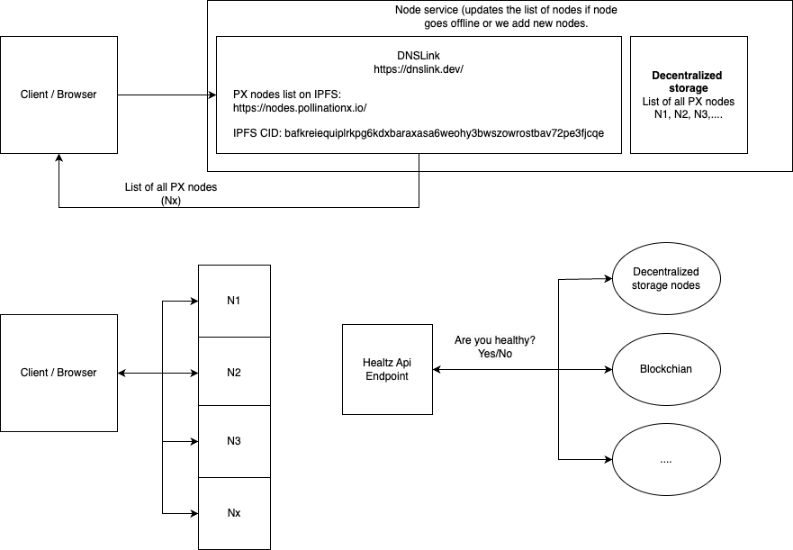

# PX Nodes

The objective is to decentralize the PX infrastructure, enhancing the robustness of the PX system as more nodes operate in a true self-custodial manner. By increasing the number of nodes, we bolster the resilience and autonomy of the PX network, promoting a more secure and democratic ecosystem for all participants.

<figure><figcaption></figcaption></figure>

### DNS link

DNSLink is used for linking DNS records to BTFS content. It allows associating a domain name with a BTFS content identifier (i.e. CID), making it easier to access BTFS content using human-readable domain names. By setting up a DNSLink, we associated a domain name nodes.pollinationx.io with the CID of the JSON file containing the list of PX nodes.

### List of Nodes on BPFS (Nx)

The JSON file stored on BTFS contains a list of URLs to all PX nodes participating in the network. Each URL represents a node's endpoint that can be used to interact with the node. This JSON file serves as a registry of all available nodes, allowing clients to discover and connect to nodes dynamically. Later the PX infrastructure will transit from a BTFS to a smart contract to serve as a registry of nodes. With that approach, anyone will be able to publish a PX node, which will be a significant step towards decentralization and improving the architecture's flexibility.&#x20;

### BTFS CID

The BTFS CID\* identifies the JSON file containing the list of PX nodes on BTFS. This hash will be later replaced with the BTNS hash. Clients can access this file by resolving the DNSLink to obtain the CID and then fetching the content from the BTFS network.

\*bafkreiequiplrkpg6kdxbaraxasa6weohy3bwszowrostbav72pe3fjcqe

### Healtz API

The Healthz API monitors the availability and status of nodes in the network. It checks whether nodes are online, responsive, and functioning as expected.  API provides real-time visibility into the operational status of the network. In addition to monitoring PX nodes, the Healthz API verifies the connectivity and health of the underlying blockchain network. It checks whether the blockchain is online and accessible, ensuring that critical infrastructure components are operational.

### Processes within the PX node;

> (1) the PX sNFT authorization process checks the wallet NFT holdings. In case of a positive (i.e. >1) wallet balance, the access token is generated for each NFT;
>
> (2) the Check Usage process checks if the access token is valid and checks if the uploader has enough storage available on the NFT;
>
> (3) the data file is transferred to the upload, and;
>
> (4) the NFT storage state is synced.


**Note:** While the PX infrastructure is natively interoperable with IPFS and IPNS, the first production integrations are made using BTFS and BTNS frameworks. Other decentralized storage network support will follow according to the project roadmap.

