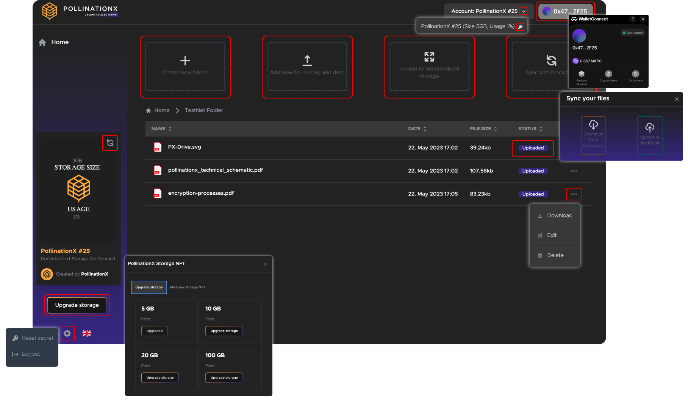

# PX dApp User Guide

<figure><figcaption></figcaption></figure>

<table data-view="cards"><thead><tr><th></th><th></th><th data-hidden></th><th data-hidden data-card-target data-type="content-ref"></th></tr></thead><tbody><tr><td>1️⃣ <strong>Connect to the app</strong></td><td>Install, login, fund your wallet and connect to PX App.</td><td></td><td><a href="px-dapp-user-guide.md#connecting-to-the-app">#connecting-to-the-app</a></td></tr><tr><td>2️⃣ <strong>Set up the dashboard</strong></td><td>Mint PX NFTs, export private keys and access dev tools.</td><td></td><td><a href="px-dapp-user-guide.md#setting-up-the-dashboard">#setting-up-the-dashboard</a></td></tr><tr><td>3️⃣ <strong>Set up the PX app account</strong></td><td>Set up or import a PX Storage NFT account.</td><td></td><td><a href="px-dapp-user-guide.md#setting-up-the-px-app-account">#setting-up-the-px-app-account</a></td></tr><tr><td>4️⃣ <strong>Manage and upload files to decentralized storage</strong></td><td>Create folders, drag and drop, edit or delete files.</td><td></td><td><a href="px-dapp-user-guide.md#managing-and-uploading-files-to-decentralized-storage">#managing-and-uploading-files-to-decentralized-storage</a></td></tr><tr><td>5️⃣ <strong>Sync the state to the blockchain</strong></td><td>Sync the file structure state to the blockchain.</td><td></td><td><a href="px-dapp-user-guide.md#syncing-the-app-state-to-the-blockchain">#syncing-the-app-state-to-the-blockchain</a></td></tr><tr><td>6️⃣ <strong>Upgrade or mint new storage NFTs</strong></td><td>Mint according to your storage needs.</td><td></td><td><a href="px-dapp-user-guide.md#upgrade-or-mint-new-storage">#upgrade-or-mint-new-storage</a></td></tr></tbody></table>

### Connecting to the app

PX app is a Web3-native application supporting [MetaMask](https://support.metamask.io/getting-started/getting-started-with-metamask/) and Wallet Connect. We recommend beginners take the [MetaMask Web3 101](https://learn.metamask.io/overview) course before starting.

Since PX app services run on-chain, ensure your wallet has enough gas for setup and operations.&#x20;

The PX app is a multi-chain application. Users can choose between several supported EVM blockchains. We recommend browsing the [supported network list](https://wiki.pollinationx.io/overview/supported-networks-and-storages) and choosing the blockchain most suited to your needs.

Steps:

* ⚙️ Install and login to a supported wallet
* 💰 Fund your wallet with gas
* 🤝 Connect your wallet with the [PX App](https://app.pollinationx.io/) (app.pollinationx.io)
* 🔗 Select blockchain

### **Setting up the dashboard**

The PX app dashboard is your mission control within the application. It lets you mint PX Storage NFTs and manage their accounts. It is also a place where devs can access integrator tools and settings.&#x20;

Steps:

* ⛏️ **Mint** PX Storage NFT according to your preferences and confirm the transaction with your wallet, read more in the "[upgrade or mint PX NFT chapter](px-dapp-user-guide.md#upgrade-or-mint-new-storage)"
* 👉 **Access** the account tab to export the account private key
* 👉 **Access** the settings tab to reset the private key within the app

### Setting up the PX app account

When you first connect to the PX app, you'll need to create or import a PX Storage NFT account. Each PX Storage NFT account has its own encryption with a unique public and private key pair. The private key allows you to export your PX Storage NFT accounts and restore your storage state on any browser-based device.

Steps:

* 🔐 **Set up** a password for the account
* 👤 **Create** a new account or import a private key of an existing one
* 🔑 If creating a new account, be sure to store the account private key securely
* ⚠️ **Follow** the instructions carefully to complete the account setup

### Managing and uploading files to decentralized storage

Once you’ve set up the dashboard, adding files to your PX storage NFT account is as easy as dragging and dropping from your computer’s file system.

Steps:

* 📂 Create folders
* 💾 Drag and drop the chosen files to the dedicated form within the app and upload the files to decentralized storage - check the upload progress on the right
* ⬇️ Download, edit or delete files by accessing the additional features menu


**Note:** When uploaded, files are split into smaller pieces, encrypted and dispersed between various decentralized storage nodes. At the same time, data reunification is possible only with the user's private key.


### **Syncing the file structure state to the blockchain**

The sync with blockchain feature enables syncing the file structure state between different devices.&#x20;

Steps:

* ⬇️ Download from blockchain - choose to download the app state
* ⬆️ Upload to blockchain - choose to upload the app state


**Note:** You have to sync the state to the blockchain first, before you sync it to another device.


### Upgrade or mint new storage

PollinationX NFTs enable easy access to decentralized storage. Users can mint decentralized storage NFTs according to their storage needs (e.g. 5GB, 20GB, 100GB). Storage is available until used. New storage NFTs can be minted according to the user's need.

Steps:

* 🚀 **Upgrade** storage - Upgrade the storage on the existing NFT located in your wallet
* ⛏️ **Mint** new storage NFT - Mints a new storage NFT
* 🔄 **Refresh** the dynamic NFT creative located at the left bottom of the dApp. Newly minted storage should appear under the usage writing.

