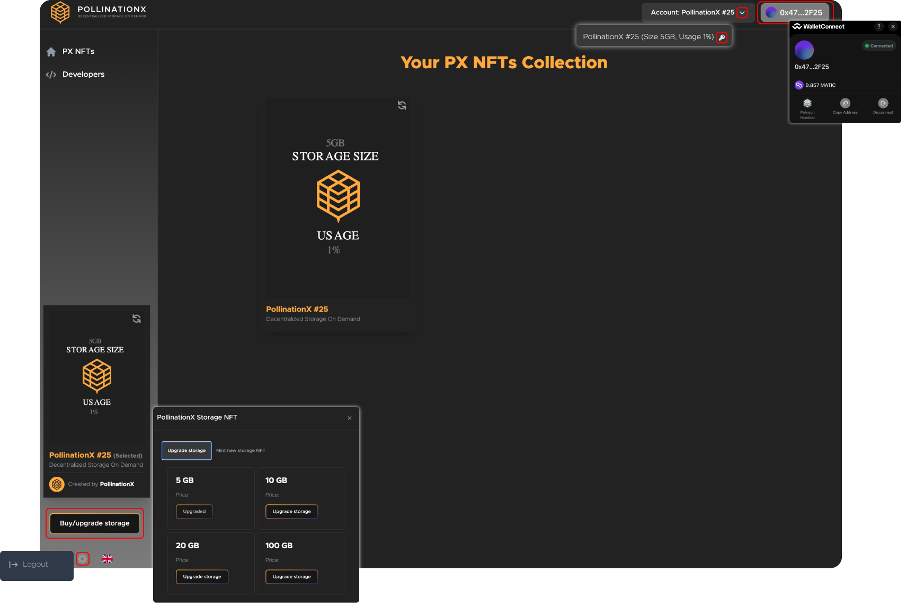

# PX dApp User Guide

## PX Drive section

<figure><figcaption></figcaption></figure>

### How to use PX Drive with supported TestNets and MainNets? 

`Step 1:` Install or login to **Wallet Connect** supported wallet (e.g. MetaMask);

`Step 2:` Connect the wallet to the chosen blockchain network;


**Tip:** Check the [list](../supported-networks-and-storages.md) of supported TestNets and MainNets.


`Step 3:` Provide sufficient wallet balance (i.e. ETH, IMMU...);

`Step 4:` Login to the [testnet.drive.pollinationx.io](https://testnet.drive.pollinationx.io/) dApp and confirm the privacy policy and software terms;

`Step 5:` Connect your wallet via **Wallet Connect**;

`Step 6:` Set your **PX Drive Account password**;


**Tip:** You can export the PX Drive account private key to import it on another device.


`Step 7:` Empty PX Drive dashboard opens. To get started mint your free 100MB [PX Storage NFT](../px-storage-nft.md);&#x20;


**Explainer:** PX Drive uses PX sNFTs to enable data file storage over decentralized storage networks. Every user is allegeable for the first `100MB` PX sNFT. To increase data storage capacity an additional storage NFT needs to be added to the wallet. Users can mint PX sNFTs according to their needs (e.g. 5GB, 20GB, 100GB). Storage is available until used.


`Step 8:` After completing the minting process additional main dashboard features open;&#x20;

> (1) Create new folder\
> (2) Add new file or drag and drop\
> (3) Upload to decentralized storage\
> (4) Sync with blockchain

`Step 9:` Create folders according to your preference and drop your data files. Files will be automatically uploaded to decentralized storage;


Data file status;\
(1) Uploading - data is being uploaded to decentralized storage\
(2) Uploaded - data was uploaded to decentralized storage\
(3) Pending - data is pending to be synced to the blockchain


`Step 10:` To enable PX Drive sync between different devices, the data must be synced to the blockchain after the upload to decentralized storage. To engage sync press the **Sync with blockchain** form;


**Note:** PX Drive sync is associated with an L1/L2 blockchain transaction. A sufficient wallet balance is needed.


`Step 11:` There are two options within the **Sync to blockchain** function;

> Download from blockchain - choose to download the Drive state \
> Upload to blockchain - choose to upload the Drive state

`Step 12:` Choose according to your specification and confirm the transaction;

### How to manage PX Drive Accounts?


**Explainer:** PX Drive accounts are managed with storage NFT-based private keys. Access your PX Drive Account private key in the top right corner under the Account button. Use your PX Drive Account private key to import the PX Drive Account to any device and access your files.



**Warning:** Do not share the **PX Drive Account private key** it with anyone. Save it to the safe place!!! Account private key enables access to your data files. You can use it for the Drive Account recovery or Drive Account import to another device.


### Upgrade or mint new storage

PollinationX NFTs enable easy access to decentralized storages. Users can mint decentralized storage NFTs according to their storage needs (e.g. 5GB, 20GB, 100GB). Storage is available until used. New storage NFTs can be minted according the the users need.

`Step 1:` Press the **Upgrade storage** button located in the left bottom corner of the dApp.

`Step 2:` There are two options available;

> (1) Upgrade storage - upgrades the storage on the existing NFT located in your wallet\
> (2) Mint new storage NFT - mints a new storage NFT

`Step 3:` Select the desired option and select the storage size;

`Step 4:` Exit the menu and refresh the dynamic NFT creative located in the left bottom of the dApp. New minted storage should appear under the **Usage** writing.

### Settings menu

The settings wheel icon is located in the left bottom corner of the PX Drive dApp. There are two options available within the settings menu;

> (1) Reset secret enables you to exit the existing Drive account and import a new one using new Account private key\
> (2) Logout - logs out of the Drive dApp

## PX Dashboard section

This is the PollinationX Dashboard manual page. Follow the steps for easier onboarding and access to all needed information.

<figure><figcaption></figcaption></figure>


**Tip:** PX Dashboard is used to mint PX sNFTs selection (e.g. FREE100MB, 5GB, 10GB, 20GB, 100GB), while PX sNFT owners can check storage state.


### How to use PX Dashboard with supported TestNets and MainNets? 

`Step 1:` Install or login to **Wallet Connect** supported wallet (e.g. MetaMask);

`Step 2:` Connect the wallet to the chosen blockchain network;


**Tip:** Check the [list](../supported-networks-and-storages.md) of supported TestNets and MainNets.


`Step 3:` Provide sufficient wallet balance (e.g. Immu, Matic, ETH...);

`Step 4:` Login to the [app.pollinationx.io](https://app.pollinationx.io/) dApp and confirm the privacy policy and software terms;

`Step 5:` Connect your wallet via **Wallet Connect**;

`Step 6:`  Mint desired storage or check PX sNFT storage state. There are two options to mint PX sNFT;&#x20;

> (1) Mint new PX sNFT\
> (2) Upgrade existing PX sNFT


**Accounts:** Each account represents available PX sNFT. Choose between available accounts to check the storage state.

