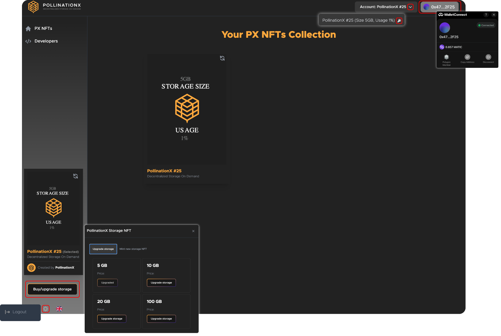

# PX Dashboard User Guide

<figure><figcaption></figcaption></figure>


**Tip:** PX Dashboard is used to mint PX sNFTs selection (e.g. FREE100MB, 5GB, 10GB, 20GB, 100GB), while PX sNFT owners can check storage state.


### How to use PX Dashboard with supported TestNets and MainNets? 

`Step 1:` Install or login to **Wallet Connect** supported wallet (e.g. MetaMask);

`Step 2:` Connect the wallet to the chosen blockchain network;


**Tip:** Check the [list](../supported-networks-and-storages.md) of supported TestNets and MainNets.


`Step 3:` Provide sufficient wallet balance (e.g. Immu, Matic, ETH...);

`Step 4:` Login to the [app.pollinationx.io](https://app.pollinationx.io/) dApp and confirm the privacy policy and software terms;

`Step 5:` Connect your wallet via **Wallet Connect**;

`Step 6:`  Mint desired storage or check PX sNFT storage state. There are two options to mint PX sNFT;&#x20;

> (1) Mint new PX sNFT\
> (2) Upgrade existing PX sNFT


**Accounts:** Each account represents available PX sNFT. Choose between available accounts to check the storage state.

