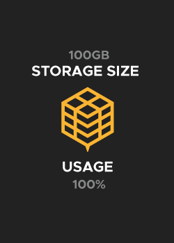

# PX Storage NFTs

PX Decentralised Storage NFTs represent the storage unit and bandwidth upload capacity, while the dynamic NFT technology enables the NFT image to reflect the real-time storage capacity state.  NFTs are available and **programmed with predetermined storage and bandwidth capacity** or can be minted according to specific needs. Key storage usage metrics are synced via `[PX]` smart contract. Based on the acquired storage in gigabytes and number of bandwidth uploads, the storage access PX sNFTs gets minted.&#x20;


**Developer Feature:** The PX sNFT owner is authorised to claim credentials to access the PollinationX SDK methods. The storage size gets updated via NFT `[PX]` smart contracts when the user uploads the files. When maxing the storage size, a new NFT must be minted.


### Integrations & Features

| dApp         | Minting    | State overview | Account overview |
| ------------ | ---------- | -------------- | ---------------- |
| PX Dashboard | <h2>✅</h2> | <h2>✅</h2>     | <h2>✅</h2>       |
| PX Drive     | <h2>✅</h2> | <h2>✅</h2>     | <h2>✅</h2>       |
| W3XShare     | <h2>✅</h2> | <h2>✅</h2>     | <h2>✅</h2>       |
| 4P Super App | <h2>✅</h2> | <h2>✅</h2>     | <h2>✅</h2>       |

### Sizes, Bandwidth & Prices

<table><thead><tr><th>Size</th><th>Bandwidth</th><th width="182">Estimated price in $</th><th>Price in Crypto</th></tr></thead><tbody><tr><td><code>100MB</code></td><td>25 uploads</td><td>Free</td><td>/</td></tr><tr><td><code>1GB</code></td><td>50 uploads</td><td>~5$ ≡</td><td>12 FTM</td></tr><tr><td><code>5GB</code></td><td>150 uploads</td><td>~15$ ≡</td><td>35 FTM</td></tr><tr><td><code>20BG</code></td><td>400 uploads</td><td>~30$ ≡</td><td>70 FTM</td></tr></tbody></table>

<table><thead><tr><th>Bandwidth</th><th width="182">Estimated price in $</th><th>Price in Crypto</th></tr></thead><tbody><tr><td>10 uploads</td><td>~1$ ≡</td><td>3 FTM</td></tr></tbody></table>


**Clarification:** GAS usage is defined in WEI & GWEI and multiplied by GAS price, which results in true L1/L2 GAS cost. References to USD prices are made for approximate fiat value illustration purposes only.


<figure><figcaption></figcaption></figure>

 

<figure><figcaption></figcaption></figure>

 

<figure><figcaption></figcaption></figure>

 

<figure><figcaption></figcaption></figure>


**Note:** Bandwidth Defines how many data files can be uploaded to decentralized storage (i.e. 1 bandwidth = 1 data file upload).


### Resources


